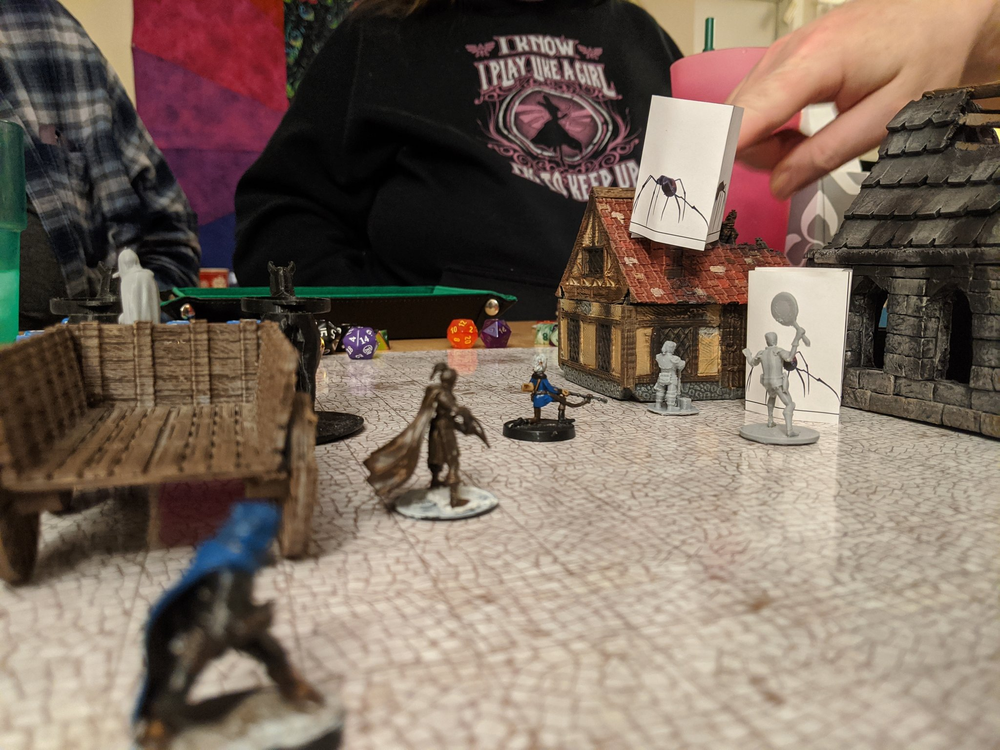
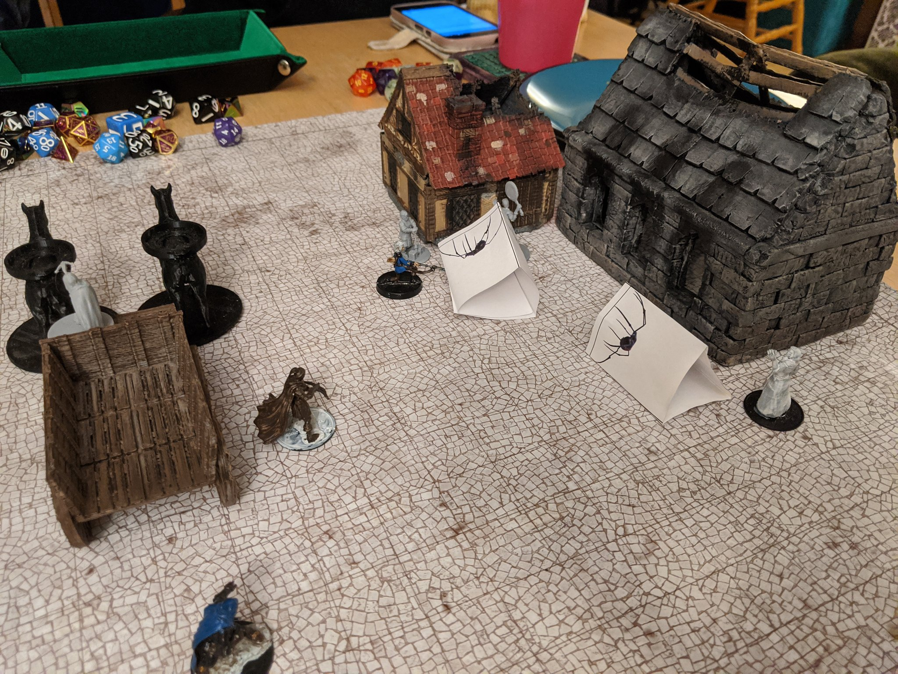

## 01/18/2020
## 
### And now for more [#]]fistfulofmithril!
### 
### -------
### 
### We resume searching the basement where we freed the Dwarven miners and beat the villain to a pulp. 
### 
### [#]fistfulofmithril
### 
### -------
### 
### Lex: so, what was your beef with this guy?
### 
### Splendid: Tried to kill me.
### 
### Knell: rude!
### 
### [#]fistfulofmithril
### 
### -------
### 
### Kyrial, to Splendid: If you have an itch to pick their pockets, at least pace yourself.
### 
### [#]fistfulofmithril
### 
### -------
### 
### Kyrial advises Lex to stop saying hello by apologizing for the villain.
### 
### "There's two important rules. #1, never tell everything you know..."
### 
### [#]fistfulofmithril
### 
### -------
### 
### Innkeeper: "Oh wow, did you do this?"
### 
### Belle: "Yes, we did." *gestures at group, and pats her trusty hammer"
### 
### Lex: "I'm assuming by "we" you meant you and your hammer?"
### 
### [#]fistfulofmithril
### 
### -------
### 
### Splendid: Are your parents still alive?
### 
### Kyrial: They were executed. In front of me.
### 
### Splendid: ...oh...
### 
### [#]fistfulofmithril
### 
### -------
### 
### DM: "she sniffs and shakes her head, and then it's gone."
### 
### Paul: HER HEAD IS GONE?!
### 
### The party: 😂😂😂
### 
### [#]fistfulofmithril
### 
### -------
### 
### Jail for D20. Jail for D20 for 1000 years.
### 
### [#]fistfulofmithril
### 
### -------
### 

### 
### -------
### 

### 
### -------
### 
### We won! [#]fistfulofmithril
### 
### -------
### 
### Uccello: eeeuurrggh...The neighborhood has gone...downhill since you lived here.
### 
### [#]fistfulofmithril
### 
### -------
### 
### Uccello: You're very charming.
### 
### Belle: I am.
### 
### Uccello: I don't *like* charming.
### 
### Belle: How terrible for you.
### 
### [#]fistfulofmithril
### 
### -------
### 
### Belle: We will help you burn many goblins.
### 
### Uccello: MANY goblins. Goblins goblins goblins goblins.
### 
### Knell: That's a very bad sign.
### 
### [#]fistfulofmithril
### 
### -------
### 
### And thus we have reached the end of today's session.
### 
### [#]fistfulofmithril