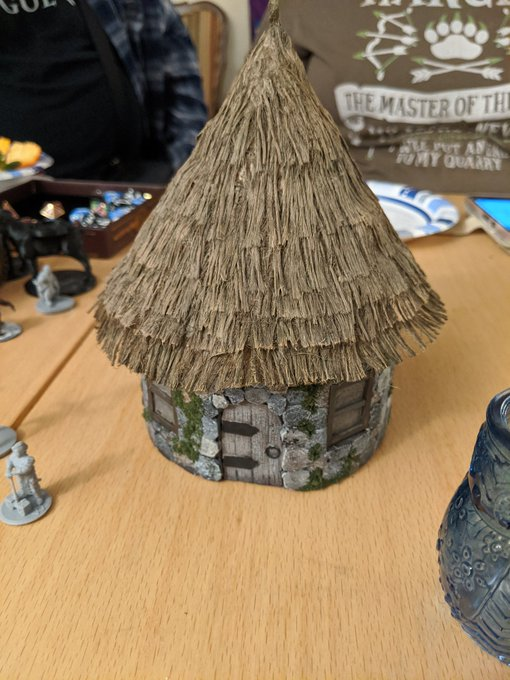
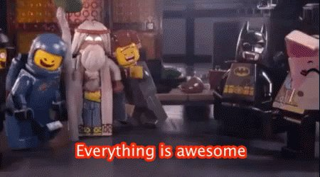

## 02/15/2020
## 
### Gonna be live tweeting highlights from our D&D campaign, [#]fistfulofmithril, again in a few hours. :D
### 
### -------
### 
### AND HERE WE GOOOO!!!
### 
### Previously, on [#]fistfulofmithril has occurred. Belle didn't get all the transcript.
###
### Now we're in the village, having made rather a lot of noise...
### 
### -------
### 
### Argento, an abandoned formerly prosperous town. Now a bunch of undead shit unlives there. This is Kyrial's hometown. Uccello leads us to his cottage.
###

### 
### -------
### 
### Uccello tells the party that there are many other things. With many names.
### 
### Uccello is...helpful.
### 
### -------
### 
### Knell: BUT THERE ARE GIANT SPIDERS. Who knows what else there is?
### 
### Assorted answers: giant bugs, zombies, skeleton.
### 
### The party is...helpful.
### 
### -------
### 
### Knell is the first roll of the day:
### 
### Wisdom roll: 8
### 
### Uccello says to hide the horses. 
### 
### -------
### 
### (I, your narrator, am supplied with tea, gin, and snacks.)
### 
### -------
### 
### Rob: the problem with critically failing your "hide the horses" role is not that something else will find them, it's that YOU won't find them.
### 
### -------
### 
### The party enters Uccello's tiny hut.
### 
### Splendid: we're just passing through
### 
### Uccello: to where?
### 
### Splendid: (where are we going?)
### 
### -------
### 
### Belle, mildly: How do you know what we want? 
### 
### Uccello: Old civilizations there are in the mountains. Do you really want that? That responsibility?...
### 
### ...the old man in the mountains sent me to look after things, keep an eye on things. 
### 
### -------
### 
### Uccello: anyone for stew?
### 
### Uccello is...a bit odd.
### 
### And he approves of Gordon's pan.
### 
### The stew appears to be vegetarian.
### 
### Uccello is...very Yoda like. 
### 
### -------
### 
### Uccello shares legends and history. In summation, humans began using magic they perhaps oughtn't. They were questioning shared reality.
### 
### -------
### 
### Elves: we were there, you don't need to question. 
### 
### Dwarves: not what you believe, it's what you do. We do things the way we do for a reason, to avoid these disasters.
### 
### Famine and disease struck down members of all races.
### 
### -------
### 
### Dwarves left because they didn't want to deal with this and had their own interests in the north.
### 
### -------
### 
### We hear something off in the distance.
### 
### ...turns out goblins ride freakin' WYVERNS.
### 
### Wyverns are from the forests nearby. They don't breathe fire, don't spit acid, and have venomous tails. They eat prey like horses and cows. They are about the size of a horse.
### 
### -------
### 
### When Kyrial lived here, the Wyverns generally kept away. Now, all bets are off.
### 
### -------
### 
### [#]notalldwarves know the curses of a given mine!
### 
### -------
### 
### Uccello, looks at Belle: your family is long gone.
### 
### Belle: from here, yes.
### 
### Uccello: why do you seek something so long lost?
### 
### Belle: Why not?
### 
### Uccello: many reasons why not.
### 
### Party: ...and?
### 
### Splendid: AUUUGGGHHH
### 
### -------
### 
### Uccello: Dwarves came here to mine for many reasons. Elves...humans...
### 
### Aron: *makes pinchy hand motions*
### 
### Paul: CRABS?
###  
### -------
### 
### Uccello: Don't listen to the rocks...! They speak! Do not listen! 
### 
### Kyrial: it's like taking to one of those magic 8 balls.
### 
### Uccello: rEpLy HaZy TrY bAcK lAtEr
### 
### -------
### 
### ...welp, apparently Uccello is coming with us.
### 
### THANKS KYRIAL
### 
### -------
### 
### We're staying with Uccello tonight. We hear the flapping of wyvern wings throughout the night.
### 
### Lex is first watch, Gordon is second watch, Belle is third.
### 
### -------
### 
### 1st watch: passes uneventfully, heard a few rumblings but nothing as loud aa the big one we heard earlier. 
### 2nd watch: also uneventful, aside from a few attention-catching sounds faraway.
### 
### -------
### 
### 3rd watch: as dawn begins to purple the sky, the wind is shifting in the nearby field, and dies down. Belle hears, suddenly, disconcertingly, nothing.
### 
### No birds. No bugs. Nothing.
### 
### -------
### 
### "Well, that ain't good."
### 
### Belle slowly backs into the hut, closes door behind her.
### 
### Nothing happens.
### 
### "There might be weird shit going on. Or there might not."
### 
### ¯\_(ツ)_/¯ 
### 
### -------
### 
### Uccello: So, you heard nothing.
### 
### Belle: yes. Disturbing nothing. Not normal nothing.
### 
### Uccello: Disturbing nothing. Thank you for your information. Lock the door behind me.
### 
### Belle: *does that*
### 
### -------
### 
### The party packs up and heads out. As we go, we're redistributing the supplies onto the horses and the party members; this terrain is no good for a cart.
### 
### -------
### 
### The party proceeds upriver to the next area of cover.
### 
### -------
### 
### "You're not in dice jail...this time."
### 
### "You're on dice parole."
### 
### -------
### 
### The silence may have been due to a cold damp natural-seeming mist rolling in.
### 
### We'll see.
### 
### -------
### 
### Knell is scouting the ridge above the canyon.
### 
### Kyrial has noticed the river has changed course recently, and consults Uccello.
###  
### Uccello: "certain people meddle with things they shouldn't."
### 
### He also tells us it's recent.
### 
### -------
### 
### Around midday, Knell notices a couple of dots in the air on the horizon, and she's pretty sure it ain't anything good.
### 
### She keeps an eye on them, and in a couple of hours, they disappear in the hill line.
### 
### -------
### 
### The party approaches the treeline, and Knell tells the rest of the party about the wyverns(?) she saw.
### 
### GUESS WHAT THEN ROARED AND IS FLYING AT US?
### 
### -------
### 
### Lex shoots the nearside wyvern.
### Belle casts Shatter; goblin rider doesn't save, wyvern saves.
### Farside wyvern swoops at Lex and misses.
### Nearside wyvern flies at Belle and rakes her with their claws.
### 
### -------
### 
### Kyrial shoots nearside wyvern.
### Knell shoots at farside wyvern and misses.
### Splendid uses Vicious Mockery.
### 
### "Which one is lucky? Shoot the unlucky one!"
### 
### -------
### 
### Battle continues. Highlights:
### 
### Gordon and Belle both held their actions. Gordon hits the wyvern with his pan. Belle misses, and the wyvern attacks her for 13 points. OUCH. She's at 9 points.
### 
### -------
### 
### But then Uccello heals her for 12, and Gordon and Knell are defending her.
### 
### -------
### 

### 
### -------
### 
### More highlights:
### 
### Shatter is a great spell.
### 
### Oh no, one of the wyverns attacked one of our horses and killed it. :C
### 
### -------
### 
### Uccello was attacked, but the wyvern missed.
### 
### Gordon hit the wyvern for f-nine, killing it. The goblin that was riding it gets yeeted from the wyvern's back into the river.
### 
### -------
### 
### Uccello does Thorn Whip to the river goblin, and obliterates him. Oops. So much for questioning that one.
### 
### There's one over at the one eating the horse though...
### 
### Knell rolls a nat 20 against the wyvern, for 10 damage. Aw yiss.
### 
### -------
### 
### Goblin falls out of saddle laughing hideously after Splendid casts. Sadly for goblin, he'd just made a very good Animal Handling roll.
### 
### Lex severely wounds wyvern. Belle insults it. Kyrial finishes it off!
### 
### Gordon has restrained the goblin.
### 
### And that's combat!
### 
### -------
### 
### Belle has healed the goblin, fed it, and cast Comprehend Languages. She is trying to communicate with the goblin through drawings in the dirt, and they are definitely interested, albeit somewhat confused.
### 
### Goblin agrees to go.
### 
### -------
### 
### Belle introduces herself, and learns that the goblin's name is Malio. Knell is skeptical and not hostile.
### 
### Belle gets 1d8 inspiration!
### 
### Belle will now attempt to learn some Goblinese and teach Malio some Florinian and Dwarven in exchange.
### 
### -------
### 
### (The archivist notes that we were not, in fact, near the trees. We're still 2-3 hours out from the trees.)
### 
### -------
### 
### Despite Belle's garbage Persuasion roll, Malio rolled lower, and has agreed to walk between Belle and Gordon. We're having him carry something proportionally heavy but not very essential.
### 
### Belle and Malio are language exchanging.
###  
### -------
### 
### Knell finds the party a good place to camp once we reach the trees.
### 
### Belle & Malio learn some words, including "unfortunate" (pronounce 8) and "fortunate" (similarly), since there are now 8 of us: Belle, Gordon, Knell, Splendid, Kyrial, Lex, Uccello, and Malio.
### 
### -------
### 
### "No gun for you". "Boom! Big baddaboom!"
### 
### Uccello is sulking about the goblin.
### 
### [Archivist notes: the goblins think not-goblins are the bad guys.]
### 
### Malio is very interested. Belle teaches him C, D, and G chords, and plays a dwarven lullaby. 
### 
### -------
### 
### Malio plays in fits and starts and teaches her a melody.
### 
### Malio is very pleased and then falls asleep leaning against Belle's arm.
### 
### Kyrial says she hopes she is invited to the wedding.
### 
### -------
### 
### Belle says not all friendships are relationships, but Kyrial points out the politically advantageous nature, and further supports her theory. Belle sighs. 
### 
### Gordon, to Knell: She's brought home another one.
### 
### -------
### 
### Belle: friendship is better than dying. I like to eat. I like to survive. In my line of work, it LITERALLY pays to make friends.
### 
### First watch (Lex & Splendid) is uneventful
### 
### Second watch (Knell & Gordon): they hear...something moving further out.
### 
### -------
### 
### They go further out, and then they hear something moving behind them. Plant sounds...
### 
### ...then one of the plants moves and attacks them. Knell sees what looks like a bush moving and attacking Gordon.  Gordon is slashed on the leg for two points.
### 
### -------
### 
### Knell attacks the bush with her axe, with a battle yell!
### 
### (Twig Blight!)
### 
### Kyrial: Is she going to make friends with the Twig Blight?
### 
### Belle: ...it's dead, so no...? 
### 
### -------
### 
### Knell: Belle is only allowed so many pets!
### 
### Kyrial: I just wanted to know what menagerie to expect.
### 
### Belle: *looks pointedly at all the humans*
### 
### [The Fortune 8!]
### 
### -------
### 
### The party is a bit less than halfway to the area where we think the mine is.
### 
### Archivist note: Belle's player and the DM  are keen on figuring out how Belle learns and what words.
### 
### -------
### 
### And that's a wrap for today!
