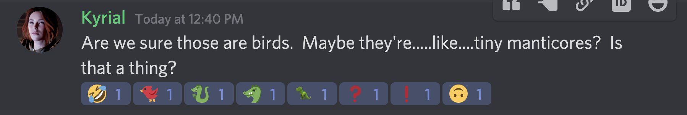

## 10/10/2020
##
### Iiiiit's time for another episode of [#]fistfulofmithril!
### 
### Today I am both Belledora Ironmaul, Dwarven Battle Bard and party archivist, and Knell Rooksward, Dwarven Rogue.
### 
### -------
### 
### Belle casts Plant Growth so we have a nice salad to go with our manticore steaks. Belle saw some berries, but agreed with Gordon that that may not be the best plan, which turns out well since a vine reached up and snatched a bird from the air.
### 
### -------
### 
### Splendid assists with Mage Hand in gathering vegetation that is further into the 100 foot radius circle of growth.
### 
### -------
### 
### Splendid assists with Mage Hand in gathering vegetation that is further into the 100 foot radius circle of growth.
### 
### -------
### 
### We are camped above the road on a hill in the trees. Kyrial and Vivian are taking a short rest, and Jane is setting up camp.
### 
### -------
### 
### Knell is helping Jane set up camp, build the fire, etc. We all return to make supper. Gordon is very occupied with making dinner. As the sun sets, several party members spot movement along the southern sky, near where the manticore came from. It's crow o'clock!
### 
### -------
### 
### The caw-caw-phony of the birds is pervasive and unending as the enormous flock passes. One landed in a nearby tree, and Belle shared some ration bread with it. It looked at her, ate the bread, and flew off, cawing. 
### 
### -------
### 
### Knell knows this is relatively normal crow behaviour.
### 
### Kyrial KNOWS the crows are out to get her, because Nature Is Scary (tm).
### 
### Vivian doesn't sense anything magic about the crows.
### 
### -------
### 
### Kyrial, after regaining her nerves when the crows are gone, spots some goblin wyvern riders, but they don't appear to be heading our way. 
### 
### -------
### 
### Kyrial: Are we sure those are birds.  Maybe they're.....like....tiny manticores?  Is that a thing?
### 
### Gordon: No, they're tiny dragons.

### 
### -------
### 
### Dinner is DELICIOUS.
### 
### It is time to sleep. Knell assists Jane in banking the fire. Belle and Jane are first watch, Kyrial and Knell second, Splendid and Gordon third.
### 
### -------
### 
### Belle is working on a creepy lullaby about crows, and Jane is meditating, in between walking the perimeter.  It's been a long day, Belle's eyes are getting heavy. She nods off over her book. Jane notices suddenly Belle has gone quiet,  she hears a soft thump.
### 
### -------
### 
### As Jane notices this, a pair of disembodied voices in unison:
### 
### "Hidden in the darkness deep
### Forth from shadows slyly creep
### Out of night with claws like shears
### Softly supping dreams and fears"
### 
### -------
### 
### "What are these in our woods, Sister Hellebore?
### Mortals come for shelter, Sister Wormwood
### Come to us for safety, do they? Fools are they"
### 
### -------
### 
### Jane waits as she hears movement coming through the underbrush, and suddenly casts Guiding Bolt toward the voices, and hits one of the hags for 12 damage. The hag stumbles backward with force, well-lit, and whoever attacks next has advantage. 
### 
### -------
### 
### Splendid fails to wake up. Gordon wakes up but takes a bunch of psychic damage from one of the hags as she uses Dreameater. Sister Wyrmwood attacks Belle for 9 damage, thus waking her up. Knell is dreaming about digging holes. Kyrial wakes up. Vivian wakes up.
### 
### -------
### 
### Jane casts Light on her hand, kicks a couple of her companions nearby who turn out to already be awake, and summons her Spiritual Weapon. She kicks Knell, but Knell just grumbles and rolls over.
### 
### -------
### 
### Sister Hellebore attempts to rake Kyrial with her claws and fails!
### 
### Splendid wakes up and sees two horrible hags with horrible claws attempting to do horrible things!
### 
### -------
### 
### Gordon SMACKS Sister Hellebore with his frying pan after missing on his first swing for 12 damage! Gordon then moves near Belle and in range of both hags. Sister Wyrmwood observes the scary triangle man with the frying pan and misses on her attack.
### 
### -------
### 
### Sister Wyrmwood then attempts to get out of range, but Gordon WHACKS her with the frying pan for 13 damage! Aw yeah, attack of opportunity!
### 
### -------
### 
### Knell wakes up with no migraine, because Dreameater did not work on her! Woot!
### 
### Everyone is awake!
### 
### -------
### 
### Kyrial slashes at Sister Hellebore's right leg with the Amputation Knife, but she misses.
### 
### Belle stands up, swings her hammer, and only catches Sister Wyrmwood's robes. Belle inspires Gordon with a bit of song, and then swears loudly in Dwarvish and in Goblin.
### 
### -------
### 
### Vivian uses Lightning Lure, and uses her Elemental Spell ability to change the damage type, and then with Curse of the Sea flings sister Hellebore away from the party.
### 
### -------
### 
### Jane casts Sacred Flame at Sister Hellebore, but Sister Hellebore dodges. Jane then swings at her with her Spiritual Weapon, but misses.  
### 
### Sister Hellebore casts Hypnotic Pattern, and Belle and Kyrial are charmed.
### 
### -------
### 
### Splendid casts Tasha's Hideous Laughter with a dad joke on Sister Hellebore, who falls to the ground laughing uncontrollably and highly disturbingly. 
### 
### Imagine a Skesis.
### 
### -------
### 
### A 6'5" Skesis. Wyrmwood TOWERS over Belle. Gordon is not chill with this, moves in range of Wyrmwood, and SMACKS her for 16 damage, causing her to reel from the pain. He attacks again for 6 points on the backhand!
### 
### -------
### 
### Wyrmwood swings with Nightmare Touch and misses, but catches Gordon with Claw for 10 slashing damage.
### 
### She tries to run, and Gordon WHACKS her for 10 on an attack of opportunity. 
### 
### -------
### 
### Wyrmwood is no more.
### 
### Hellebore, however, is still prone & laughing her head off.
### 
### Knell tries to attack Hellebore w/ her War Pick, but misses TERRIBLY even with advantage (rolling 4 and 1), so uses Cunning Action to move herself out of Hellebore's melee range.
### 
### -------
### 
### Vivian holds a lightning cantrip while she waits for the next person to hit Hellebore.
### 
### Jane swings with her spiritual weapon and misses. 
### 
### Wyrmwood is still laughing her head off (she failed her wisdom save).
### 
### -------
### 
### *that was Hellebore, not Wyrmwood. My bad.
### 
### Splendid shakes Belle out of her stupor. Yay!
### 
### Gordon, no longer having to shake Belle out of it, moves over to Hellebore and SMACKS her for 10 damage and misses on #2. Vivian's held cantrip misses, unfortunately.
### 
### -------
### 
### Knell attacks the prone Hellebore with her War Pick for 7 damage! Kyrial attacks Hellebore's right leg with her amputation blade for 14 damage. Hellebore loses the use of her right leg for the next 1d4 rounds. DM isn't telling us what he rolled. 
### 
### -------
### 
### Belle smack Hellebore with her hammer for 6 damage, and gives Jane Bardic Inspiration. BUT. Vivian finishes off Hellebore with a crapton of lightning. Awww yeah!
### 
### Hag screams are chilling, btw.
### 
### -------
### 
### Intermission!
### 
### -------
### 
### Aaand we're back!
### 
### -------
### 
### The quiet again descends on the clearing. The party resolves to have the two least hurt people who don't need the long rest do an 8 hour watch while the rest of us sleep to restore our spell slots and hit points, but we need a more secure spot to camp.
### 
### -------
### 
### We move further from forest to camp more securely for our rest. Jane heals Gordon for several points, and Gordon and Vivian keep watch while the others sleep.
### 
### "The ocean's just a desert with its life underground."
### "The ocean's just a desert turns upside down."
### 
### -------
### 
### ### The night passes uneventfully. It's about 9am, everyone is awake, and everyone except Vivian and Gordon is at full HP and spell slots.
### 
### We're about a half day's journey out from Argento.
### 
### -------
### 
### We arrive there uneventfully. The ruined town is before us, including site of Kyrial's family's old keep, currently occupied by goblins & hobgoblins. Hobgoblin captains, etc, tend to live there. The town itself is largely left to the goblins, lower in status.
### 
### -------
### 
### Kyrial & Knell walk in front, followed by Belle & Gordon, Splendid, Jane, and Vivian. There's a statue of Kyrial's 7-times great grandmother in the middle of the square with a big, gnarled winter-bare tree towering over top. One of the statue's arms is missing.
### 
### -------
### 
### It looks like someone tried to topple it, but they didn't manage to, and Kyrial takes this as an omen.
### 
### Knell and Kyrial creep to the ramshackle tavern to investigate setting up subtle headquarters there.
### 
### -------
### 
### The party sets up there. Kyrial and Knell are keeping watch. 
### 
### Four goblins appear in the village green, talking quietly amongst themselves. Kyrial gestures to Belle, and Belle goes to greet them, holding up Malio's necklace.
### 
### -------
### 
### "Hello, good folks. May I speak with you?"
### 
### The goblins look at her warily, and then one of them says "The dwarf woman! The bard Malio told us about!"
### 
### Belle brings them into the tavern where Vivian and Gordon are snoozing and Splendid and Jane are waiting. 
### 
### -------
### 
### They had asked if she had come alone, so she showed them she had not.
### 
### "We have heard of all you have done from Malio. You are most welcome."
### 
### Kerrig, Skaria, Filoh, & Gizbit introduce themselves, and Belle introduces her party members, in mostly-fluent Goblin.
### 
### -------
### 
### And that's all for today! Tune in next time when  Sunnie returns to play Knell once more!
### 
### This is Belledora Ironmaul, battlebard and archivist, signing off for today.